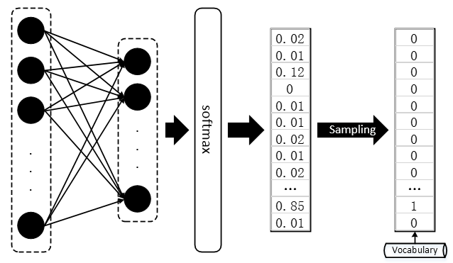
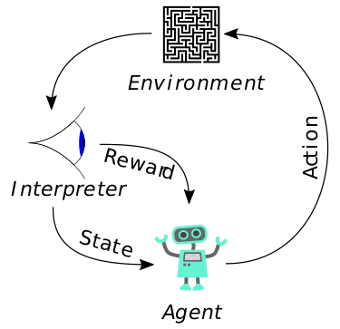
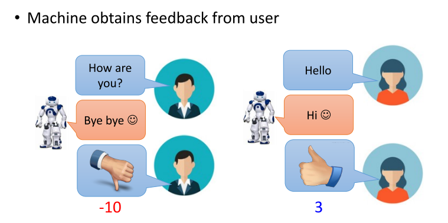
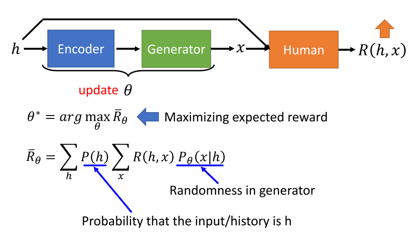
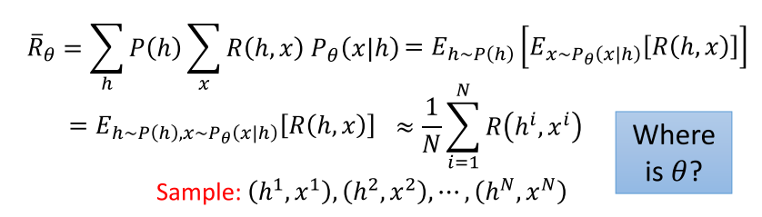
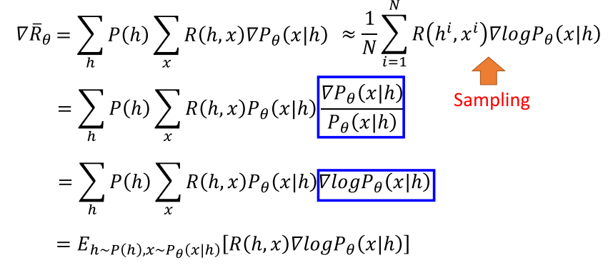
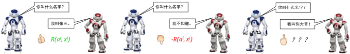

## paper list

- [Generating Sentences from a Continuous Space](https://arxiv.org/abs/1511.06349)
- [GANS for Sequences of Discrete Elements with the Gumbel-softmax Distribution
](https://arxiv.org/abs/1611.04051)
- [Categorical Reparameterization with Gum-bel-Softmax](https://arxiv.org/abs/1611.01144)
- [Deep Reinforcement Learning for Dialogue Generation](https://arxiv.org/pdf/1606.01541v3.pdf)
- [Generative Adversarial Networks](https://arxiv.org/abs/1406.2661v1)
- [李宏毅老师讲seqGAN](https://www.bilibili.com/video/av9770302/?p=17)
- [Role of RL in Text Generation by GAN(强化学习在生成对抗网络文本生成中扮演的角色)](https://zhuanlan.zhihu.com/p/29168803)
- [好玩的文本生成](https://blog.csdn.net/ycy0706/article/details/80425091)

## 为什么GAN不适合文本生成
前面学过了GAN很自然的就会想到将GAN引入到文本生成中来，比如对话可以看作是conditional GAN, 但实际上却并不如想象中那样简单，原因是GAN只适用于连续数据的生成，对离散数据效果不佳。描述主体能够观察到什么的规则

[Role of RL in Text Generation by GAN(强化学习在生成对抗网络文本生成中扮演的角色)](https://zhuanlan.zhihu.com/p/29168803) 这里面从两方面讲的很清楚:  
- sampling：从生成得到的softmax probability到one-hot向量，从而查询出对应index的词，这一步称为“sampling”，显然是不可微的。  
- 去掉sampling,将softmax probability和one-hot vector作为discriminator的输入，如果是discriminator是一个二分类器的话，判别器D很容易“作弊”，它根本不用去判断生成分布是否与真实分布更加接近，它只需要识别出给到的分布是不是除了一项是 1 ，其余都是 0 就可以了。因此，我们也可以想到用WGAN来解决这个问题。[Improved Training of Wasserstein GANs]()也给出了文本生成的实验，效果当然是好了很多，不至于直接崩了。

但是WGAN为什么没那么好呢？将一个softmax probability强行拉倒一个one-hot vector真的可行吗？

## Gumbel-softmax，模拟Sampling的softmax

## RL in text generation  
### reinforcement learning  
[reinforcement learning](https://en.wikipedia.org/wiki/Reinforcement_learning) 和监督学习、非监督学习一起构成机器学习的三大范式。  
> Reinforcement learning (RL) is an area of machine learning concerned with how software agents ought to take actions in an environment so as to maximize some notion of cumulative reward.  
It differs from supervised learning in that labelled input/output pairs need not be presented, and sub-optimal actions need not be explicitly corrected. Instead the focus is finding a balance between **exploration** (of uncharted territory) and **exploitation** (of current knowledge)

RL所适用的环境是一个典型的马尔科夫决策过程(Markov decision process,MDP)。所以强化学习实际上也可以看作是一种动态规划的方法。不过与传统的dynamic programming方法不同的是，RL不会假设MDP的精确数学模型的知识。我的理解是，在很多DP问题中，状态转移矩阵是已知的，但是RL所处理的问题，从一个状态到另一个状态，不是根据已有的知识，而是取决于当前action带来的reward以及未来的reward,所以这也就涉及到了 exploration 和 exploitation 的平衡问题。

 Markov decision process 包括：GANs-in-NLP/Reinforcement_learning_diagram.png
 - 环境以及agent状态的集合 S;    
 - agent能采取的动作的集合 $A$  
 - 状态之间转换的规则 $P_a(s,s')=Pr(s_{t+1}=s'|s_t=s,a_t=a)$  
 - 规定转换之后的即时奖励 $R_a(s,s')$    
 - 描述主体能够观察到什么的规则

#### policy   
将从头到尾所有的动作连在一起就称为一个“策略”或“策略路径” $pi$ ，强化学习的目标就是找出能够获得最多奖励的最优策略.
$\pi: A\times S \rightarrow [0,1]$
$\pi(a,s)=Pr(a_t=a|s_t=s)$

#### state-value function  
状态-值函数 $V_{\pi}(s)$ 定义在当前状态 s下，按照策略 $\pi$ 接下来能获得的 reward.也就是说，given state s，当前以及未来的reward期望.  
$$V_{\pi}(s)=E[R]=E[\sum_{t=0}^{\infty}\gamma^tr_t|s_0=s]$$  
其中 $\gamma^t$ 是折扣因子，因为还是当前利益最重要嘛，所以未来的reward要打个折。
$$R=\sum_{t=0}^{\infty}\gamma^tr_t$$

#### value function  
value funcion 和 state-value function 的区别是后者给定了一个 state. 而value function是计算给定任意初始状态，得到的reward.
$$V^{\pi}=E[R|s,\pi]$$

所以最优的 policy 实际上就是 value function 的期望最大。$\rho^{\pi}=E[V^{\pi}(S)]$， 其中状态S是从一个分布 $\mu$ 随机采样得到的。

尽管 state-value 足够定义最优 policy，再定义一个 action-value 也是很有用的。 given state s, action a, policy $\pi$, action-value:
$$Q^{\pi}(s,a)=E[R|s,a,\pi]$$

个人理解，在强化学习的应用场景中，很多时候是由 action 来确定下一个 state 的。所以 action-value 这个function会更实用吧。比如 text generation，sample当前词就是 action，然后才有下一个时刻的 state.

#### Monte Carlo methods

#### Temporal difference methods

## RL应用到对话场景下
[Deep Reinforcement Learning for Dialogue Generation](https://arxiv.org/pdf/1606.01541v3.pdf)

对话生成任务本身非常符合强化学习的运行机理（让人类满意，拿奖励）。

输入句子是 h,模型返回的response是 x，其从人类得到的奖励是 $R(h,x)$. 基于RL的目标函数就是最大化对话的期望奖励。上图中 $p_{\theta}(x,h)$ 表示在 $\theta$ 参数下，一组对话 $(x,h)$ 出现的概率。$P(h)$ 表示出现句子 h 的概率。

最大化奖励期望：

- 上式中 $h\sim P(h)$ 可以看作是均匀分布，所以 $E_{h\sim P(h)}\approx \dfrac{1}{N}$.  
- 其中 $E_{x\sim P_{\theta}(x|h)}$ 的计算无法考虑所有的对话，所以通过采样 $(h^1,x^1), (h^2,x^2), .., (h^N,x^N)$ 来计算。

然后问题来了，我们需要优化的参数 $\theta$ 不见了，可以采用强化学习中常用的 policy gradient 进行变形：
$$\dfrac{dlog(f(x))}{dx}=\dfrac{1}{f(x)}\dfrac{df(x)}{dx}$$

第一步中加了一个log，因为log是单调递增的，所以不影响最后的结果。这样最终的奖励期望的函数表达式包含 $\theta$.

这样一来，梯度优化的重心就转化到了生成对话的概率上来，也就是说，通过对参数 $\theta$ 进行更新，奖励会使模型趋于将优质对话的出现概率提高，而惩罚则会让模型趋于将劣质对话的出现概率降低。

>自AlphaGo使得强化学习猛然进入大众视野以来，大部分对于强化学习的理论研究都将游戏作为主要实验平台，这一点不无道理，强化学习理论上的推导看似逻辑通顺，但其最大的弱点在于，基于人工评判的奖励 Reward 的获得，让实验人员守在电脑前对模型吐出来的结果不停地打分看来是不现实的，游戏系统恰恰能会给出正确客观的打分（输/赢 或 游戏Score）。基于RL的对话生成同样会面对这个问题，研究人员采用了类似AlphaGo的实现方式（AI棋手对弈）——同时运行两个机器人，让它们自己互相对话，同时，使用预训练（pre-trained）好的“打分器”给出每组对话的奖励得分 R(a^i, x^i) ，关于这个预训练的“打分器” R ，可以根据实际的应用和需求自己DIY。

## SeqGAN 和 Conditional SeqGAN
