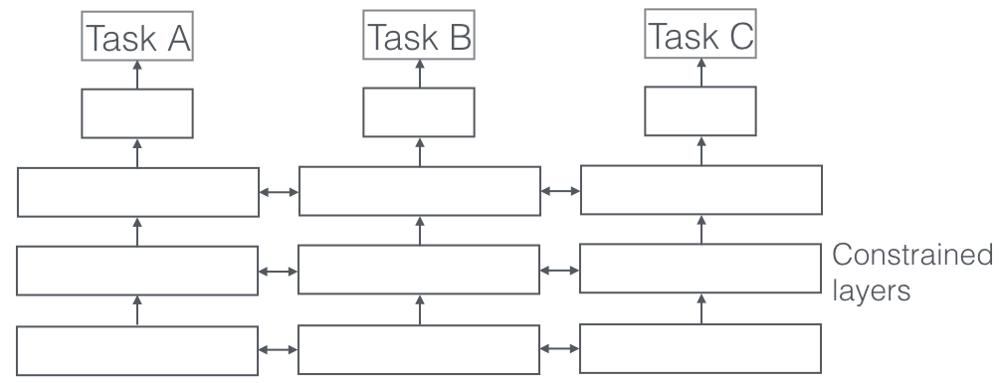

## Motivation

> we can motivate multi-task learning from a machine learning point of view: We can view multi-task learning as a form of inductive transfer. Inductive transfer can help improve a model by introducing an inductive bias, which causes a model to prefer some hypotheses over others. For instance, a common form of inductive bias is $l_1$ regularization, which leads to a preference for sparse solutions. In the case of MTL, the inductive bias is provided by the auxiliary tasks, which cause the model to prefer hypotheses that explain more than one task. As we will see shortly, this generally leads to solutions that generalize better.  
多任务学习的动机：我们可以把多任务学习看作是一种归纳迁移。归纳迁移通过引入归纳偏置，来使得模型更倾向于某种假设空间。比如，L1正则化就使得模型更倾向于稀疏解。在多任务学习中，通过辅助任务来提供归纳偏置，使得模型倾向于能解释更多的任务的假设空间。

## Two MTL methods for Deep Learning
So far, we have focused on theoretical motivations for MTL. To make the ideas of MTL more concrete, we will now look at the two most commonly used ways to perform multi-task learning in deep neural networks. In the context of Deep Learning, multi-task learning is typically done with either **hard or soft parameter sharing** of hidden layers.

### Hard parameter sharing

> Hard parameter sharing greatly reduces the risk of overfitting.In fact, [7] showed that the risk of overfitting the shared parameters is an order N -- where N is the number of tasks -- smaller than overfitting the task-specific parameters, i.e. the output layers. This makes sense intuitively: The more tasks we are learning simultaneously, the more our model has to find a representation that captures all of the tasks and the less is our chance of overfitting on our original task.  
hard 参数学习能显著降低过拟合的风险。[7] 通过理论验证了，多任务学习的过拟合风险系数是 N 阶的，N是任务的个数。

### Soft parameter sharing

> In soft parameter sharing on the other hand, each task has its own model with its own parameters. The distance between the parameters of the model is then regularized in order to encourage the parameters to be similar. [8] for instance use the $l_2$ norm for regularization, while [9] use the trace norm.  
soft 参数共享是不同的任务具有不同的参数，但是通过 constrained 约束来使得某些层的参数更接近，而不是完全一致。这种约束可以使 $l_2$ 范式，也可以是  trace norm.

## Why does MTL work?
Even though an inductive bias obtained through multi-task learning seems intuitively plausible, in order to understand MTL better, we need to look at the mechanisms that underlie it. Most of these have first been proposed by Caruana (1998). For all examples, we will assume that we have two related tasks A and B, which rely on a common hidden layer representation F.
