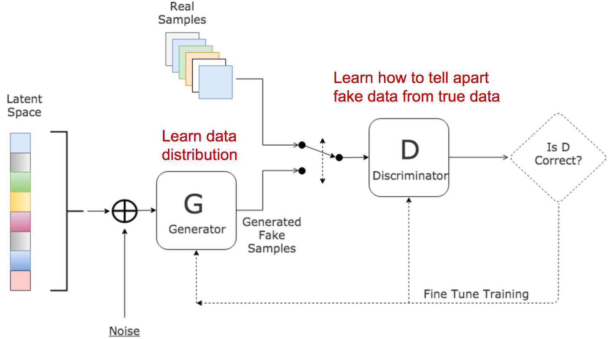
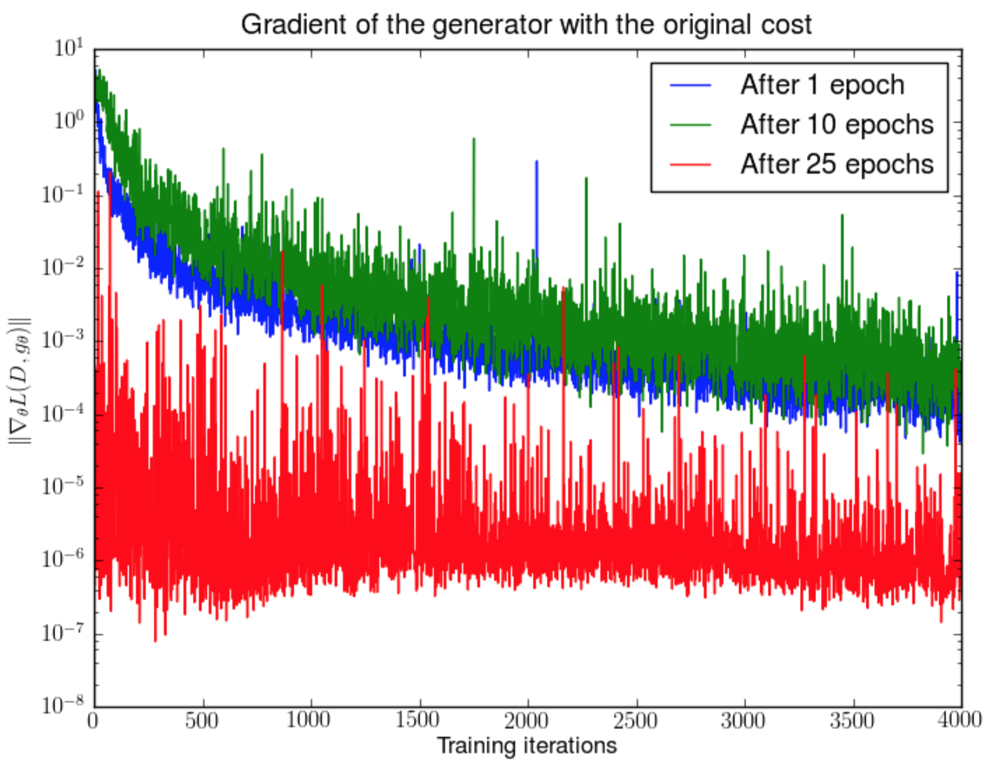

# From GAN to WGAN
纵所周知，GAN非常难训练，在训练时总是会面临训练不稳定，以及难以收敛的情况。这里，作者尝试通过阐述GAN背后的数学原理，来解释为什么GAN不好训练，并且介绍了GAN的另一个版本来更好的解决这些训练难题。

[From GAN to WGAN](https://lilianweng.github.io/lil-log/2017/08/20/from-GAN-to-WGAN.html)

## Kullback–Leibler and Jensen–Shannon Divergence
在学习GAN之前，先回顾一下如何衡量两个概率分布相似度的标准。

### KL (Kullback–Leibler) divergence
[如何通俗的解释交叉熵与相对熵?](https://www.zhihu.com/question/41252833)

**熵**:  

信息量可表示为 $log\dfrac{1}{p}$，其可理解为概率为p的随机事件所包含的信息量。比如“太阳明天早上在东边升起”，这个概率p=1，那么其所包含的信息就为0了。所以信息量与概率p成反比。至于为什么就一定是 $log\dfrac{1}{p}$ 这种形式,这需要去问香农爷爷了。。

而熵则是信息量的期望，也可以理解为**随机性的度量**。随机性越大，熵越大。

**交叉熵**  

两个概率分布p和q，p为真实分布，q为非真实分布。按照真实分布来衡量识别一个样本或者是判断随机事件的准确性的度量，就是熵，也就是信息量的期望 $H(p)=\sum_ip(i) * log\dfrac{1}{p(i)}$,但是事实是，我们无法得知这个真实的分布，只能通过统计来预测这个分布，也就是用非真实分布q去衡量这个熵，$H(p,q)=\sum_ip(i) * log\dfrac{1}{q(i)}$, 注意这里的概率是真实分布 p(i). H(p,q)就是我们的“交叉熵”。  
当用来预测的非真实分布q越接近真实分布，其随机性越小，准确率也就越高。

**相对熵/KL散度**  

根据[Gibbs' inequality](https://en.wikipedia.org/wiki/Gibbs%27_inequality)上述例子中的 $H(p,q) >= H(p)$ 恒成立。当且仅当q=p时，这个等号才成立。那么熵H(p,q)相比熵H(q)多出来的部分就是相对熵 $D(p||q)=H(p,q)-H(p)=\sum_ip(i)* log\dfrac{p(i)}{q(i)}$，也称为KL散度(Kullback–Leibler divergence，KLD).

从机器学习的角度去思考，我们预测得到的非真实分布就是q，当模型越好时，q与p越接近，也就是模型的准确度越高，随机性越小，所以交叉熵/相对熵也就越小。反过来，就可以通过交叉熵/相对熵来训练我们所需的模型了～

所以：
$$D_{KL}(p||q)=H(p,q)-H(p)=\sum_ip(i)* log\dfrac{p(i)}{q(i)}=\int_x{p(x)}log\dfrac{p(x)}{q(x)}dx$$

但是，这里有个问题，p和q并不是完全对称的。显然当p(x)为0，q(x)为非零值时，q(x)的影响就不存在了。反过来呢，q不可能为零。所以当两个概率完全相等时，用KL散度来衡量两个概率的相似度就会存在问题了。

### Jensen–Shannon Divergence
JS散度的范围是[0,1],并且是完全对称的。

$$D_{JS}(p \| q) = \frac{1}{2} D_{KL}(p \| \frac{p + q}{2}) + \frac{1}{2} D_{KL}(q \| \frac{p + q}{2})$$

p是均值为0，方差为1的正态分布，q是均值为1，方差为1的正态分布。两者的均值的分布是 m=(p+q)/2.可以看到 $D_{Kl}$ 是非对称的，而 $D_{JS}$ 是对称的。

[How (not) to Train your Generative Model: Scheduled Sampling, Likelihood, Adversary?
](https://arxiv.org/pdf/1511.05101.pdf)认为GAN能成功的很大一部分原因是用JS散度代替了传统的基于极大似然估计的KL散度。

## Generative Adversarial Network (GAN)
GAN 包含两个模型：  
- Discrimator D: 判别器D用来估计来自 real dataset 的样本的概率。它通过区分 fake sample和real example 来优化自身。  
- Generator G: 给定随机输入变量z（随机z带来了多样性），输出得到合成的样本。G的训练是通过捕捉真实样本的分布，从而生成尽可能真实的样本，换句话说，就是欺骗判别器D使得生成的样本获得较高的概率。

### Generator
实际上，可以把神经网络 G 看作是用来定义一个分布，$p_g$, 使得这个分布尽可能的接近真实样本的图像在高维空间中的分布 $p_r$.

但是问题在于，如何去评判两个 distributin 的接近程度呢，也就是 $Div(p_g,p_{data})$ 怎么计算？

### Discrimator
GAN 牛逼的地方就是用另一个神经网络来判断这两个 distribution:

### loss function
G 和 D 两个模型在训练中是相互博弈的过程。G 尽可能的去欺骗 D，而 D 则尽可能的不被欺骗。这是一个有趣的zero-sum游戏。

- 一方面，我们通过最小化 $E_{x\sim p_r(x)}[logD(x)]$ 来保证判别器D在 real data $p_r$ 上的准确率。与此同时，生成得到的 fake 样本，G(z), $z\sim p_z(z)$，判别器D期望对于 fake 样本的概率D(G(z))越接近于0越好，也就是最大化 $E_{z\sim p_z(z)}[log(1-D(G(z)))]$.

- 另一方面，生成器训练的目的就是让判别器D在fake样本上得到的概率更大，也就是最小化 $E_{z\sim p_z(z)}[log(1-D(G(z)))]$.

所以对于 G 和 D 是一个博弈，分别最大和最小化 $E_{z\sim p_z(z)}[log(1-D(G(z)))]$.

联合两方面，D和G正在进行的就是一个 minimax game，而我们所需优化的loss function就是：
$$% <![CDATA[
\begin{aligned}
\min_G \max_D L(D, G)
& = \mathbb{E}_{x \sim p_{r}(x)} [\log D(x)] + \mathbb{E}_{z \sim p_z(z)} [\log(1 - D(G(z)))] \\
& = \mathbb{E}_{x \sim p_{r}(x)} [\log D(x)] + \mathbb{E}_{x \sim p_g(x)} [\log(1 - D(x)]
\end{aligned} %]]>$$

在梯度下降更新时，$E_{x\sim p_r(x)}[logD(x)]$ 对生成器没有影响。

疑问：这里 $p_g$ 是基于x的生成器的分布。p_r 也是基于x的真实样本的分布。这里的x是一样的吗？

### What is the optimal value for D?
定义好了 loss function，接下来推导对于D的最优解.
$$L(G,D)=\int_x(p_r(x)log(D(x))+p_g(x)log(1-D(x)))$$
D(x)为何值时能最小化L(G,D)呢？为利于简写，我们假设：
$$\tilde x=D(x), A=p_r(x), B=p_g(x)$$

对积分内部求导（这里可以忽略积分，因为x是采样任何可能的值）：

$$% <![CDATA[
\begin{aligned}
f(\tilde{x})
& = A log\tilde{x} + B log(1-\tilde{x}) \\
\frac{d f(\tilde{x})}{d \tilde{x}}
& = A \frac{1}{ln10} \frac{1}{\tilde{x}} - B \frac{1}{ln10} \frac{1}{1 - \tilde{x}} \\
& = \frac{1}{ln10} (\frac{A}{\tilde{x}} - \frac{B}{1-\tilde{x}}) \\
& = \frac{1}{ln10} \frac{A - (A + B)\tilde{x}}{\tilde{x} (1 - \tilde{x})} \\
\end{aligned} %]]>$$

然后，令 $\dfrac{df(\tilde x)}{d\tilde x}=0$,可以得到D(x)的最优解：  
$D^* (x) = \tilde{x}^* = \frac{A}{A + B} = \frac{p_{r}(x)}{p_{r}(x) + p_g(x)} \in [0, 1]$

我们训练 gan 的目的是得到最优的生成器。一旦生成器训练到其最优时，$p_g$ 更接近 $p_r$, 当 $p_g=p_r$ 时，$D^* (x)=\dfrac{1}{2}$.

反过来也就是说，当 $D^* (x)=\dfrac{1}{2}$ 时，我们能优化得到最优的生成器。

### What is the global optimal?

当 G 和 D 都训练达到我们想要的优化值时，也就是 G 最优则有 $p_g=p_r$, $D^* (x)=\dfrac{1}{2}$， 这时 loss function就是：
$$% <![CDATA[
\begin{aligned}
L(G, D^* )
&= \int_x \bigg( p_{r}(x) \log(D^* (x)) + p_g (x) \log(1 - D^* (x)) \bigg) dx \\
&= \log \frac{1}{2} \int_x p_{r}(x) dx + \log \frac{1}{2} \int_x p_g(x) dx \\
&= -2\log2
\end{aligned} %]]>$$

前面的这部分都是基于我们设计的 loss function，计算得到G最优时，对应的 loss 值为 $-2log2$. 后面的部分是验证 JS 散度与这个 loss function的联系。

### What does the loss function represent?
根据前面JS散度的公式可得：  

$$% <![CDATA[
\begin{aligned}
D_{KL}(p_r||\dfrac{p_r+p_g}{2})
&=\int_xp_r(x)log\dfrac{p_r(x)}{\dfrac{p_r(x)+p_g}{2}}dx \\
&=log2 + \int_xp_r(x)log\dfrac{p_r(x)}{p_r(x)+p_g}dx
\end{aligned} %]]>$$

$$% <![CDATA[
\begin{aligned}
D_{KL}(p_g||\dfrac{p_r+p_g}{2})
&=\int_xp_g(x)log\dfrac{p_g(x)}{\dfrac{p_r+p_g(x)}{2}}dx \\
&=log2 + \int_xp_g(x)log\dfrac{p_g(x)}{p_r+p_g(x)}dx
\end{aligned} %]]>$$

所以：

$$% <![CDATA[
\begin{aligned}
D_{JS}(p_{r} \| p_g)
=& \frac{1}{2} D_{KL}(p_{r} || \frac{p_{r} + p_g}{2}) + \frac{1}{2} D_{KL}(p_{g} || \frac{p_{r} + p_g}{2}) \\
=& \frac{1}{2} \bigg( \log2 + \int_x p_{r}(x) \log \frac{p_{r}(x)}{p_{r} + p_g(x)} dx \bigg) + \\& \frac{1}{2} \bigg( \log2 + \int_x p_g(x) \log \frac{p_g(x)}{p_{r} + p_g(x)} dx \bigg) \\
=& \frac{1}{2} \bigg( \log4 + L(G, D^* ) \bigg)
\end{aligned} %]]>$$

因此，
$$L(G,D^* )=2D_{JS}(p_r||p_g)-2log2$$

我们发现，我们之前设计的 loss function 与当判别器D*是最优时（$D*=\dfrac{1}{2}$），$p_r=p_g$ 时的JS散度是一致的。也就是当生成器 G* 能得到与真实样本一致的分布时，$D_{JS}(p_r||p_g)=0$, $L(G^*, D^*) = -2\log2$

**结论：** 通过上述证明是为了说明我们所设计的 loss function 是合理的。也就是 loss 值最小时，G和D最优，$p_r=p_g, D^* =\dfrac{1}{2}$, 也是满足分布 $p_g$ 和 $p_r$ 的JS散度为 0（意味着 $p_r$ 和 $p_g$ 一致）。

### Problems in GANs
尽管 GAN 在图像生成上取得了很大的成功，但是其训练并不容易，过程很慢切不稳定。

#### Hard to achieve Nash equilibrium
[Improved Techniques for Training GANs](http://papers.nips.cc/paper/6125-improved-techniques-for-training-gans.pdf) 讨论了 GAN 的训练过程，两个模型需要通过训练找到纳什均衡(Nash equilibrium)，并且这是一个two-player non-cooperative game. 然而两个模型中的任何一个在更新其代价函数时都是独立的，与另一个player没有关系。同时更新两个模型的梯度并不能保证收敛。

思考：两个模型有共享的参数吗？没有。判别器的输入虽然包括生成器的输出，但是其并不更新生成器的参数。

作者举了这个一个例子：  

两个玩家分别控制不同的参数 x 和 y，其目标更是相反的。这会导致收敛非常困难。

#### Low dimensional supports
有两个数学概念：
- [Manifold](https://en.wikipedia.org/wiki/Manifold): A topological space that locally resembles Euclidean space near each point. Precisely, when this Euclidean space is of dimension n, the manifold is referred as n-manifold.  
拓扑空间，在每个点附近局部类似于欧几里德空间。 确切地说，当该欧几里德空间具有n维时，该流形被称为n-流形。

- [Support](https://en.wikipedia.org/wiki/Support_(mathematics)): In mathematics, the support of a real-valued function f is the subset of the domain containing those elements which are not mapped to zero.  
在数学中，实值函数f的支持是包含那些未映射到零的元素的域的子集

[“Towards principled methods for training generative adversarial networks”.](https://arxiv.org/pdf/1701.04862.pdf) 这篇非常理论的论文讨论了对于 $p_r$ 和 $p_g$ 的support是处于低维的空间，并且这导致了GAN的训练中的不稳定性。
真实样本空间具有高度的人工特征，因为它的主题一旦确定，其包含的对象也就固定了。比如dog应该有two ears和a tail.一个Skyscraper应该有straight和tall的身体。这些限制使得图像不具备高维空间的形式。

同样的 $p_g$ 也是在低维流形空间。当给定初始的噪声输入变量为100维，生成器将其作为输入生成较大的图像 $64\times 64$，对于输出的分布 4096 pixels已经被100维随机的向量定义了，所以它也很难去填满整个高维空间。

因为 $p_r$ 和 $p_g$ 都是处于低维流形，他们很大可能性是不相交的。当他们具备不相交的特性时，我们就很容易找到一个完美的判别器来准确的100%区分fake样本和真实样本。

左侧图是两条线在三维空间。右侧是两个平面在三维空间。通过维度的对比来表明相交的可能性。

#### Vanishing gradient
当判别器非常完美的时候，$D(x)=1,\forall x\in p_r$, $D(x)=0, \forall x\in p_g$.
$$L(G,D)=\int_x(p_r(x)log(D(x))+p_g(x)log(1-D(x)))$$
带入这个公式可以发现，loss function L 会降为0，在迭代过程中，梯度也就无法更新。下图证明了，当判别器越好的时候，梯度消失越快。

图中是 DCGAN 在 1,10,25 epochs之后的训练。在生成器固定的情况下，判别器从头开始训练，我们会发现，梯度的一范式以log规模的速度衰减。

#### Mode collapse
在训练过程中，生成器可能会崩塌，而总是生成同样的输出，这在 GANs 的训练中经常会出现的问题就是模型崩塌 Mode collapse。尤其是当生成器能够欺骗判别器，但却不去学习复杂的 real-word 的数据分布，而是陷在一个缺乏多样性的空间。

来自 DCGAN 中的图片，结果已经呈现出一定程度的模型崩塌。

#### Lack of a proper evaluation metric
GAN 没有一个好的目标函数来描述训练过程。没有好的验证指标，就好比在黑暗中work. 没有信号来提示该在什么时候停止，也没有好的指标来评价多种模型的好坏。

### Improving GAN Training  
下面给出了如何稳定的训练和提升 GAN。

- [Improve Techniques for Training GANs](http://papers.nips.cc/paper/6125-improved-techniques-for-training-gans.pdf)  

- [Towards principled methods for training generative adversarial networks](https://arxiv.org/pdf/1701.04862.pdf)

#### Feature Matching
使用 feature matching 来优化判别器，同时可以检查生成器的分布是否符合真实样本的分布。可以定义一个 loss function $\| \mathbb{E}_{x \sim p_r} f(x) - \mathbb{E}_{z \sim p_z(z)}f(G(z)) \|^2_2$ 其中 f(x) 可以使任何统计特征，比如均值或中值。

#### Minibatch Discrimination
对于判别器，以batch的形式输入，而不是单独的输入。

#### Historical Averaging
对于两个模型 G 和 D，将 $\| \Theta - \frac{1}{t} \sum_{i=1}^t \Theta_i \|^2$ 加入到 loss function 中，其中 $\Theta$ 是模型参数， $\Theta_i$ 是过去时刻的模型参数。这添加的项用来惩罚参数变化过大的情况。

####　One-sided Label Smoothing
对于判别器的 label 0 or 1.可以使用 label smoothing. 这样做可以减少网络的脆弱性(vulnerability).

#### Virtual Batch Normalization (VBN)
样本归一化基于固定的 batch(reference batch)，而不是其输入样本自身的 minibatch. reference batch 在训练初期就设定好，并且在整个训练过程中保持不变。

#### adding noise
在前面讨论了 $p_r$ 和 $p_g$ 在高维空间的不相交会导致梯度消失。所以，我们认为的增加这两个分布的重复的可能性，一种解决方法就是在判别器的输入时连续的随机增加噪声。

#### Use Better Metric of Distribution Similarity
前面的 loss function 用来测量两个分布 $p_r$ 和 $p_g$ 的 JS 散度。但是当两个分布不相交时，这个指标不能提供有效的意义。

[Wasserstein metric](https://en.wikipedia.org/wiki/Wasserstein_metric) 相比 JS 散度具有更光滑的值空间。

### Wasserstein GAN (WGAN)
