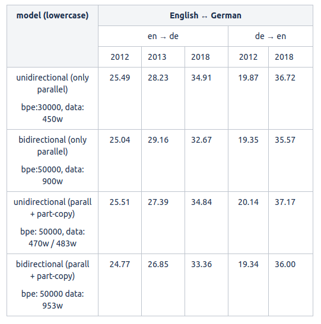
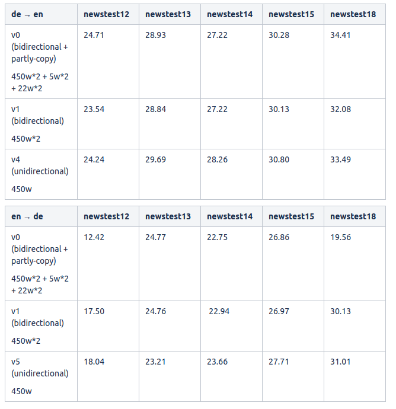

### partly-copy

### experiment 1
训练集：  
- 平行语料：450w (WMT19)  
- 伪平行语料：de-side: 33w (partly-de → de),  en-side: 20w (partly-en → en)，双语词典 de: 17021, en: 10753

开发集： newstest 2016 + 2017

测试集：newstest 2018

### experiment 2
平行语料： 330w (stanford)
伪平行语料：
- partly-copy with rare word: 5w(de->en), 5w(en->de)
- partly-copy with common phrase: 22w(de->en), 23w (en->de)

for example:

==> de-en.sample.rare-25.src <==
raymond briggs : snowmen , bogeymen & **milchmänner** 9pm , bbc two

==> de-en.sample.rare-25.tgt <==
raymond briggs : snowmen , bogeymen & **milkmen** 9pm , bbc two

==> en-de.sample.rare-25.src <==
" aufgrund dieses weitreichenden verbots bedarf es für besorgniserregende biologische forschung grundsätzlich einer plausiblen rechtfertigung durch friedliche zwecke " , erklärt silja vöneky , **jurist** an der universität freiburg .

==> en-de.sample.rare-25.tgt <==
" aufgrund dieses weitreichenden verbots bedarf es für besorgniserregende biologische forschung grundsätzlich einer plausiblen rechtfertigung durch friedliche zwecke " , erklärt silja vöneky , **rechtswissenschaftlerin** an der universität freiburg .

实验结果：

分析实验可能出现的问题：
1. 数据问题，平行语料的选择。毕竟 experiment1 和 experiment2 的 BLEU 差距明显。
2. 加上 partly-copy with common phrase 后 partly-copy 占的 bilingual 太大，导致模型有 copy 的倾向？

### experiment 3
- pb: parallel data  
- ma: partly-copy pseudo parallel data by common phrase  
- mb: partly-copy pseudo parallel data by rare/hard word  
- bt: back-translation pseudo parallel data  
- []: at later epochs  
- * : replace word or phrase before bt

#### 1 .Ablation test to identify the importence of partly copy
1. pb
2. pb + ma
3. pb + mb
4. pb + ma + mb
5. pb + [bt(ma) + bt(mb)]  
6. pb + ma + mb + [bt(ma) + bt(mb)]
7. pb + ma + mb + [bt(ma*) + bt(mb*)] ~= pb + ma + mb + [bt(ma) + bt(mb*)]

实验预期：
1. 对比实验 1和2 能说明，加上包含 common phrase 的伪平行预料能提升整体 BLEU  
2. 对比实验 1和3 能说明，加上包含 rare/hard word 的伪平行预料能有效解决 never aligned 的翻译问题  
3. 对比实验 1和4 能说明 partly-copy 在解决 rare/hard word 的翻译问题的同时，还能提高整体的 BLEU  
4. 实验 5 的目的是验证在 pb 基础上训练得到的模型，不能有效翻译 rare word/phrase
4. 实验 6 的目的是是与实验 4 进行对比，类似于一种 trick，在学习到对齐关系之后，在进一步构建包含 rare/phrase，common phrase 的纯伪平行语料（不是mixed的），希望能在实验 4 的基础上有提升
5. 实验 7 的目的是与实验 6 进行对比，在实验 6 的基础增加一种 trick，保证 bt 得到的纯伪平行语料中 rare word 翻译的准确性，希望在实验 6 的基础上对 rare word 的翻译更为准确。

实验记录：

**work@zjy-ai-g4p40-translator02**

- v4
  - unidirectional model, de->en
  - parallel data (450w)

- v5
  - unidirectional model, en->de
  - parallel data (450w)

- v0 (对应实验 4)
  - bidirectional model + partly-copy
  - pure parallel data(450w * 2)
  - rare-word-partly-copy(5w * 2)
  - usual phrase partly-copy(22w * 2)

- v1（对应实验 1）
  - bidirectional model
  - parallel data

- V6（对应实验 3）
  - bidirectional model
  - pure parallel data(450w * 2)
  - rare-word-partly-copy(5w * 2)

- V7（对应实验 2）
  - bidirectional model
  - pure parallel data(450w * 2)
  - common-phrase-partly-copy(5w * 2)
