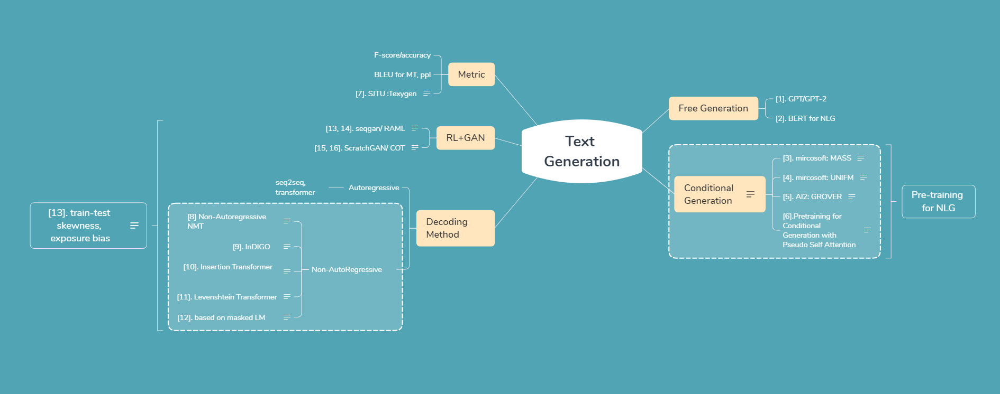
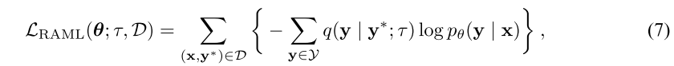
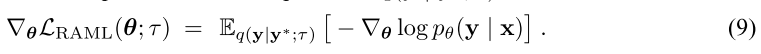
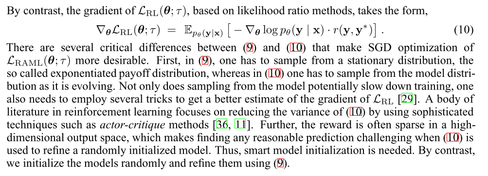

写这篇博客源于在知乎上看到大佬Towser在 “BERT模型在NLP中目前取得如此好的效果，那下一步NLP该何去何从？” 这个问题下的回答，对于文本生成的总结觉得太赞了。所以基于大佬的回答，画了一个脑图(http://www.xmind.net/m/AcA3bE)，接下来一两个月的时间也决定按照这个路线进行学习。

## Reward Augmented Maximum Likelihood for Neural Structured Prediction
### Motivation

#### Maximum likilihood based method
对于NMT或者其他的 conditional generation，最常用的seq2seq模型是基于maximum likilihood(ML)来最小化下面这个目标函数的：
$$L_{ML}=\sum_{(x,y^* )\in D}-logp_{\theta}(y^* |x)$$

但是这种方式存在几个问题:  

- Minimizing this objective increases the conditional probability of the target outputs, $logp_{\theta}p(y^* |x)$, while decreasing the conditional probability of alternative incorrect outputs. According to this objective, all negative outputs are equally wrong, and none is preferred over the others.  
在最大化目标函数，意味着增加 ground truth output的概率 $logp_{\theta}p(y^* |x)$，减少其他错误输出的概率。这个过程中，对于错误的output，模型认为所有的negative output都是同等的，这其实是不太正确的。

- [Generating Sentences from a Continuous Space]():However, by breaking the model structure down into a series of next-step predictions, the rnnlm does not expose an interpretable representation of global features like topic or of high-level syntactic properties.  
将结构化输出的预测问题，分解成一系列word prediction(seq2seq在训练阶段，其目标函数的loss是将所有的word对应的cross entropy加起来，并没有将sentence作为一个整体来进行优化)，所以使得模型很难学到global feature，类似于topic或者high-level的句法特性。  

- exposure bias的问题。[Quantifying Exposure Bias for Neural Language Generation](https://arxiv.org/pdf/1905.10617.pdf)

#### RL based method
$$L_{RL}(\theta;\tau,D)=\sum_{(x,y^* )\in D}\{-\tau\mathbb{H}(p_{\theta}(y^* |x))-\sum_{y\in \mathbb{Y}}p_{\theta}(y|x)r(y,y^* )\}\quad{(1)}$$
D 表示 training parallel data. $\mathbb{H}(p)$ 表示概率分布 $p_{\theta}$ 对应的交叉熵, $H(p(y))=\sum_{y\in \mathbb{Y}p(y)logp(y)}$. $\tau$ 表示 temperature parameter，是一个超参。这个公式的理解可以与上一篇blog中seqgan的公式对应起来：
$$J(\theta)=E[R_T|s_0,\theta]=\sum_{y_1\in V}G_{\theta}(y_1|s_0)\cdot Q_{D_{\phi}}^{G_{\theta}}(s_0,y_1)\quad{(2)}$$

（1）式中的第2项就是（2）式。那么（1）式中的第一项表示的是Maximum likilihood的交叉熵？

使用RL based的方法存在这样两个问题：  
- 使用随机梯度下降SGD来优化 $L_{RL}(\theta;\tau)$ 非常困难，因为reward对应的gradients的方差很大(large variance).  
- 没能有效利用到监督信息。  

作者提出了一种新的方法，能结合ML和RL的优势。

#### RAMI
作者在output space定义了一个 exponentiated payoffdistribution, 表示ML和RL的central distribution：
其中 $Z(y^* ,\tau)=\sum_{y\in \mathbb{Y}}exp\{r(y, y^* )/\tau\}$. 简单点理解就是基于 $r(y,y^* )$ 计算得到的reward r，然后softmax得到的分布。
$$q(y|y^* ;\tau)=\dfrac{1}{Z(y^* ,\tau)}exp\{r(y, y^* )/\tau\}\quad(3)$$

> 显然，这个 $r(y,y^* )$ 的计算是基于 BLEU 来计算的。这样一来，既考虑到了不同的 y 之间的差异性，也将 BLEU 的计算转换成了 distribution.

然后作者推导了各种公式证明了从ML的角度来优化 $q(y|y^* ;\tau)$ 和 $p_{\theta}(y|x)$ 的KL散度等效于优化 $L_{RL}$.

所以 reward-augmented maximum likelihood (RAML) 的loss function可以写成:

> Note that the temperature parameter, $\tau \ge 0$, serves as a hyper-parameter that controls the smoothness of the optimal distribution around correct targets by taking into account the reward function in the output space.

##### optimization
对于 $L_{RAMI}(\theta;\tau)$ 的优化很简单，就是直接通过 $q(y|y^* ;\tau)$ 来sampling出 unbiased samples y. 如果超参数 $\tau=0$,那么就只能sample出 $y^* $.

对公示（７）求导，可以得到：　　

这里 $q(y|y^* ;\tau)$ 是通过 $y^* $ 来sample y,不包含需要训练的参数的。所以 RAMI 也就是优化log-likelihood,不过这里的 y 不是ground truth，而是基于 ground truth和评估指标metric来sample得到的y.

对比基于 RL 的优化，作者进行了吐槽：

1. RL中sample得到的样本 y 是通过生成模型得到的，而且这个model还是不断进化的。这使得训练速度很慢，比如 seqgan 中的roll-out policy.  
2. reward 在高维output空间非常稀疏，这使得优化很困难。   
3. actor-critique methods.

##### Sampling from the exponentiated payoff distribution
在通过公式（9）进行优化之前，需要先通过 exponentiated payoff distribution $q(y|y^* ;\tau)$ 来sample得到 y. This sampling is the price that we have to pay to learn with rewards. 这个sample过程与RL相比是没有参数的，瞬间简单了很多啊。。

那么具体是怎么sample的呢，作者使用的基于edit distance的方法。

- 给定的ground truth $y^* $ 长度是m  
- 基于edit distance $y^* $ sample出与 $y^* $ 距离在 e 范围内的sentences y, 其中 $e\in \{0,...,2m\}$.  

知乎上有大佬对这篇paper做了一个简单的总结, [NLP八卦每日谈 2](https://zhuanlan.zhihu.com/p/67214174).

RL: x --> 通过decoder sample一个句子y' --> 和y计算metric --> 把metric作为reward，算policy gradient

RAML: y --> 通过和metric对应的一个distribution sample一个句子y* --> 把y* 作为GT进行ML训练

这样做的好处是RL的sample是根据decoder sample，而decoder有参数，所以需要policy gradient。而RAML，是根据y（target sentence）来sample句子。这样就没有参数的问题，也就不需要policy gradient了。

RAML看起来几乎完美，不存在任何优化问题。可天下没有免费的午餐。RAML的难点在于如何将Metric转化成对应的distribution。RAML只提供了将诸如edit distance等metric转化成dist的方法，但对于BLEU等却无能为力。

所以目前为止，RAML的主要贡献在于让我们理解RL language generation到底train了个啥。简单来说就是不学ground truth distribution，而学习一个跟metric相关的dense distribution。这么做的好处是y的distribution更大，相对来说更容易学习

##### 关于结构化预测related work
(a) supervised learning approaches that ignore task reward and use supervision;  
(b) reinforcement learning approaches that use only task reward and ignore supervision;  
(c) hybrid approaches that attempt to exploit both supervision and task reward.
