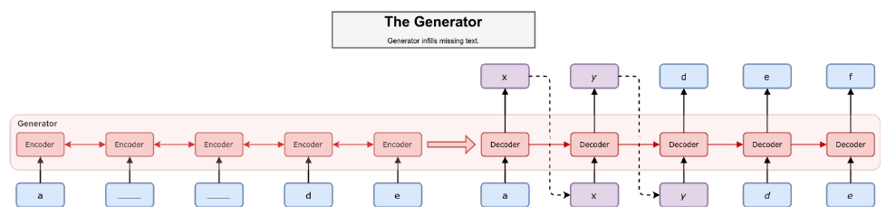

## Training Language GANs from Scratch
发现一个问题，目前看到language gans的相关paper大部分是Google，DeepMind的paper. 感觉是个深不见底的坑，弱渣哭了。。。

### Motivation
我们知道language GAN非常难训练，主要是因为gradient estimation, optimization instability, and mode collapse等原因，这导致很多NLPer选择先基于maximum likelihood对模型进行预训练，然后在用language GAN进行fine-tune.作者认为这种 fine-tune 给模型带来的benefit并不clear，甚至会带来不好的效果。  

> 关于mode collapse，李宏毅老师讲过，在对话生成时，模型总是倾向于生成“我不知道”，”我知道了”这样通用的没有太多sense的回复，其实就是属于mode collapse. 类似于图像领域，既要生成鼻子，又要生成嘴巴，但是模型会倾向于生成一个居中的distribution来模拟这两个distribution。  
> 关于gradient estimator，是因为对于离散的数据，其gradients的方差会很大。

[13-16]就是先使用ML预训练模型，然后在此基础上adversarial fine-tune.[17-18]则说明了 “that the best-performing GANs tend to stay close to the solution given by maximum-likelihood training”.

所以作者为了证明language GAN真的能work，就from scratch训练了一个language GAN, 对，没有预训练。作者认为从头训练好language GAN的核心技术是 **large batch sizes, dense rewards and discriminator regularization**.

本文的贡献：  
1. 从头训练一个language GAN能达到基于ML方法的unconditional text generation.  
2. 证明 **large batch sizes, dense rewards and discriminator regularization** 对于训练language GAN的重要性。  
3. 作者对文本生成模型的evaluation提出了一些性的拓展，能充分挖掘生成的language更多的特性。比如：
    - BLEU and Self-BLEU [19] capture basic local consistency.    
    - The Frechet Distance metric [17] captures global consistency and semantic information.    
    - Language and Reverse Language model scores [18] across various softmax temperatures to capture the diversity-quality trade-off.    
    - Nearest neighbor analysis in embedding and data space provide evidence that our model is not trivially overfitting.   

### Generative Models of Text
生成模型的本质就是对unknown data distribution进行建模，也就是学习模型 p(x|y) 的参数。在传统的机器学习里面，我们认为模型 p(x|y) 的分布就是多维高斯正态分布，然后用EM算法去学习得到参数。在基于neural network的自然语言处理领域，对于 $x=[x_1,..,x_T]$， $p_{\theta}(x_t|x_1,...,x_{t-1})$ 也可以看作是学习这样一个distribution，只不过模型的参数不是高斯正态分布这么简单，而是基于network来模拟的。同样序列特性使得其非常适合使用自回归模型进行建模:
$$p_{\theta}=\prod_{t=1}^Tp_{\theta}(x_t|x_1,...,x_{t-1})$$

### Maximum Likelihood
一旦模型建立好了，接下来就是训练模型。最常用的方法就是使用极大似然估计 maximum likelihood estimation(MLE).

$$\argmax_{\theta}\mathbb{E}_{p^* (x)}logp_{\theta}(x)$$

关于 maximum likelihood 是否是最优解，这篇paper有讨论[9]。

### Generative Adversarial Networks

前面seqgan也说过自回归模型中 $p_{\theta}=\prod_{t=1}^Tp_{\theta}(x_t|x_1,...,x_{t-1})$的过程有个sample的操作，这是不可导的。针对这个问题，有三种解决方法：  
- 高方差，无偏估计的 reinforce[28]. 基于大数定律的条件下，去sample更多的example，来模拟 $p(y_t|s_t)$ 的分布，然后基于policy gradient去优化这个distribution，这使得速度很慢。  
- 低方差，有偏估计的 gumbel-softmax trick[29-30].  
- other continuous relaxations[11].  

### Learning Signals
对于generator的训练，作者采用了基于 REINFORCE 的方法:

其中同 MaliGAN[15] 一样，设置 $R(x)=\dfrac{p^* (x)}{p_{\theta}(x)}$, 这样等效于 MLE 估计。

基于MLE eatimator的梯度更新可以看作是reinforce的一个spacial case.区别在于language gans的reward是可以学习的，也就是discriminator是不断更新的。可学习的discriminator的效果已经被证明过了[34].

如果learned reward能够提供相比MLE loss更光滑的信号，那么discriminator就能提供更多有意义的signal，甚至training data没有cover的distribution.

同时，discriminator是可以ensemble的，使用更多的domain knowledge.这样能学习到更多的信息。

### Training Language GANs from Scratch
作者通过实验验证，要训好一个language gans，所需要的是：  
- a recurrent discriminator used to provide dense rewards at each time step  
- large batches for variance reduction  
- discriminator regularization

#### dense rewards  
判别器能够判别generated sentence和real sentence，但是对于不完整的句子，就没办法去判断。这就造成，如果generated sentence很容易就被判断为fake，那么在fix discriminator训练generator时，生成器无法获得有意义的信号，也就是梯度为0吧。

为了避免这种情况，作者采用了 [MaskGAN](https://arxiv.org/abs/1801.07736)[32] 的方法:  

#### maskGAN

maskGAN是一种 actor-critic 方法，利用类似于完形填空的形式，只需要生成被挖去的词，就能对整个sentence进行判别，并计算reward，这样得到的reward相比sentence中的每一个词都是生成的，其variance会小很多。

具体做法是：

1. 生成器是 seq2seq 的形式，输入sequence $x=(x_1,...,x_T)$. 通过 binary mask $m=(m_1,...,m_T)$ 得到 $m(x)$.  
2. 根据 m(x) 来生成得到完整的 generated examples $\hat x=(\hat x_1, \hat x_2,...,\hat x_T)$.

3. 这里生成的时候参考上图，如果当前time-step被mask了，则需要用到上一个time-step生成的词，如果没有被mask，就直接使用当前词，类似于teacher-forcing.  
4. 判别器就是计算每一个词为真的概率，注意这里判别器的输入也有 m(x)，其原因是让模型更好的识别生成的sentence中，哪一个是之前被mask了的。  
$$D_{\phi}(\tilde x_t|\tilde x_{0:T}, m(x)) = P(\tilde x_t=x_t^{real}|\tilde x_{0:T}, m(x))$$
5. reward 的计算：  
$$r_t=logD_{\phi}(\tilde x_t|\tilde x_{0:T}, m(x))$$

#### Large Batch Sizes for Variance Reduction

reference:
[9] How (not) to train your generative model: Scheduled sampling, likelihood, adversary? arXiv
[12-16]
[17-18]
[32] Maskgan: Better text generation via filling in the
[34]
