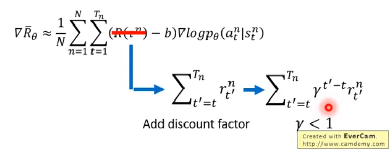
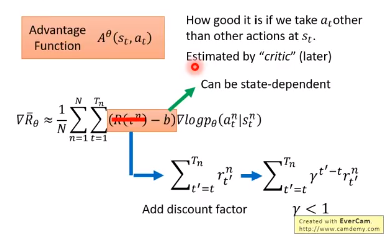
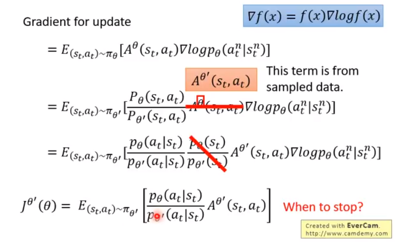
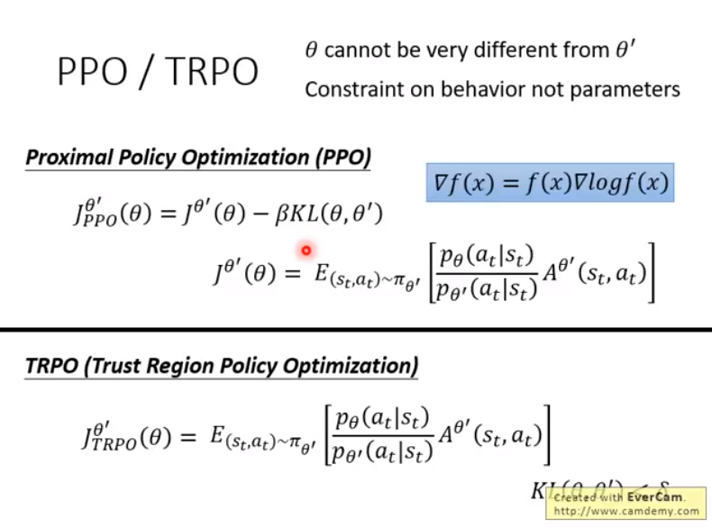
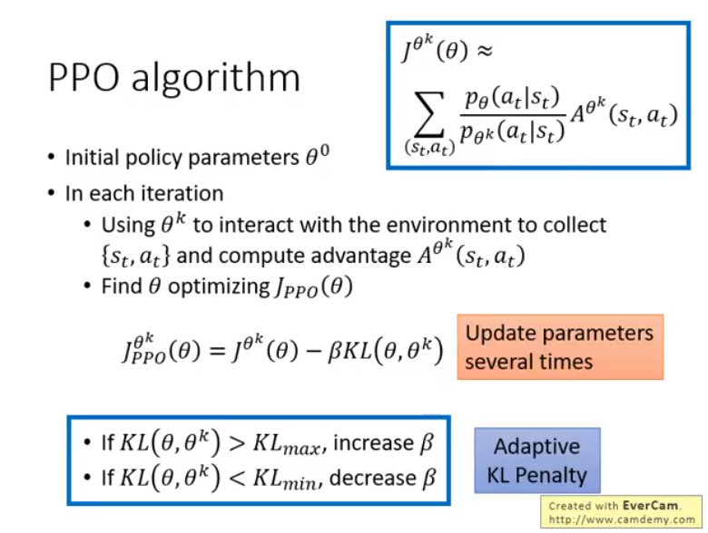
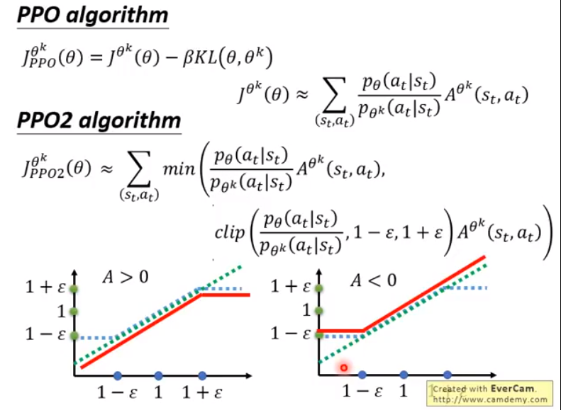
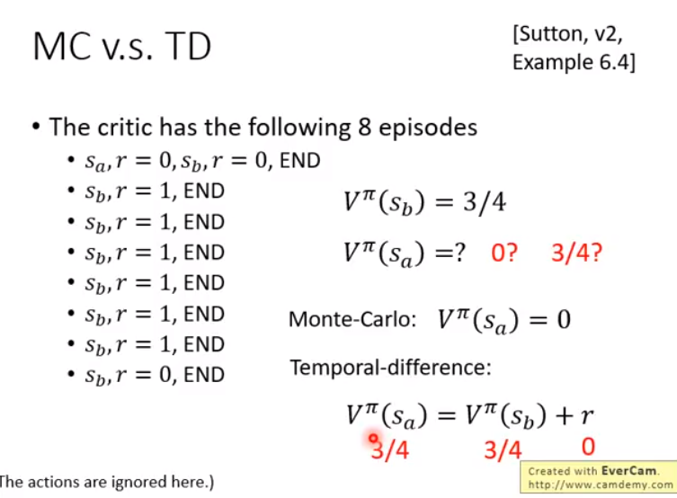

## policy gradient  
**add baseline**

$$\nabla{\overline R}_{\theta}=\dfrac{1}{N}\sum_{n=1}^N\sum_{t=1}^{T_n}(R(\tau^n)-b)\nabla logp_{\theta}(a_t^n|s_t^n)$$

**assign suitable credit**

$$\nabla{\overline R}_{\theta}=\dfrac{1}{N}\sum_{n=1}^N\sum_{t=1}^{T_n}(\sum_{t'=t}^{T_n}r_{t'}^n-b)\nabla logp_{\theta}(a_t^n|s_t^n)$$

add discount factor

**advantage function**
action $a_t$ 的好是相对的，而不是绝对的。它可以是 state-dependent.

## on-policy and off-policy
### importance sampling

### on-policy to off-policy

### PPO(proximal policy optimization)

$\theta, \theta'$ 并不是distribution，而是参数。那么这里的 $kl(\theta, \theta')$ 到底是什么？
这里的kl divergence 实际上是行为上的差距，也就是 action 分布的距离。那这个意思就是我们还是得用 $\theta$ 去求出 action 的 distribution，但是我们不用去sample出样本了。可以继续需要用 $\theta'$ sample出来的样本，但是需要给reward乘以系数 $\dfrac{p_{\theta}(a_t|s_t)}{p_{\theta'}(a_t|s_t)}$.

### PPO2

因为 $kl(\theta, \theta')$ 的计算还是蛮复杂的，所以用ppo2来代替。方法也是很直接，用clip的方式代替原来的正则项。

## Critic

### MC v.s. TD

sample同样的结果，采用 MC 和 TD最终计算的结果也是不一样的。

MC考虑的是，当前state $s_a$ 对未来的 state $s_b$ 可能也是有影响的. 所以MC实际上是要计算到整个游戏（episode）结束。
