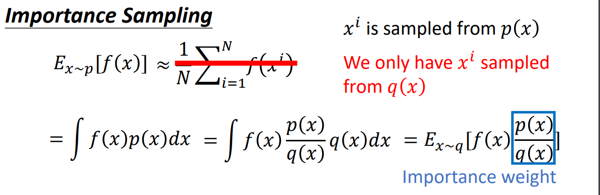
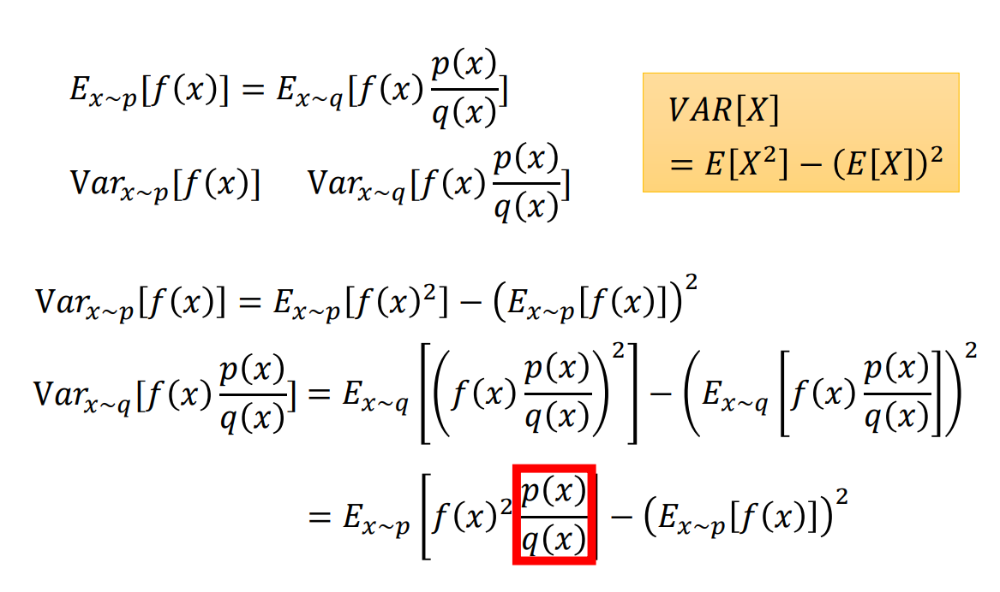
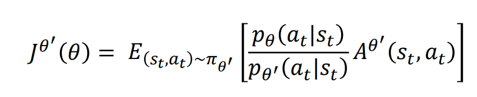

## policy gradient
### basic
[Deriving Policy Gradients and Implementing REINFORCE](https://medium.com/@thechrisyoon/deriving-policy-gradients-and-implementing-reinforce-f887949bd63) 这篇博客详细推导了 policy gradients 的过程，虽然公式很多，但其实还算简单。

最终的结论就是，从公式(1)推导为公式(2):

$$J(\theta)=\mathbb{E}[\sum_{t=0}^{T-1}r_{t+1}|\pi_{\theta}]=\sum_{t=1}^{T-1}P(s_t, a_t|\tau)r_{t+1}\quad(1)$$

$$\nabla_{\theta}J(\theta)=\sum_{t=0}^{T-1}\nabla_{\theta}log\pi_{\theta}(a_t|s_t)(\sum_{t'=t+1}^T\gamma^{t'-t-1}\gamma_{t'})\quad(2)$$
其中 $Gt=\sum_{t'=t+1}^T\gamma^{t'-t-1}\gamma_{t'}$

公式(2)可简化为:  
$$\nabla_{\theta}J(\theta)=\sum_{t=0}^{T-1}\nabla_{\theta}log\pi_{\theta}(a_t|s_t)G_t$$

之后就是针对 policy gradient 的各种改进。接下来的公式参数是根据李宏毅老师课程来的。所以与上面的有差异。

### add baseline

$$\nabla{\overline R}_{\theta}=\dfrac{1}{N}\sum_{n=1}^N\sum_{t=1}^{T_n}(R(\tau^n)-b)\nabla logp_{\theta}(a_t^n|s_t^n)$$

### assign suitable credit

$$\nabla{\overline R}_{\theta}=\dfrac{1}{N}\sum_{n=1}^N\sum_{t=1}^{T_n}(\sum_{t'=t}^{T_n}r_{t'}^n-b)\nabla logp_{\theta}(a_t^n|s_t^n)$$

### add discount factor

### advantage function
action $a_t$ 的好是相对的，而不是绝对的。它可以是 state-dependent.

## on-policy and off-policy
### importance sampling

issue of importance sampling:

采用 importance sampling，会导致sample 得到的action的分布方差发生变化。因此要保证action的分布尽可能与

### on-policy to off-policy

### PPO(proximal policy optimization)
**add constraint:**

$\theta, \theta'$ 并不是distribution，而是参数。那么这里的 $kl(\theta, \theta')$ 到底是什么？
这里的kl divergence 实际上是行为上的差距，也就是 action 分布的距离。那这个意思就是我们还是得用 $\theta$ 去求出 action 的 distribution，但是我们不用去sample出样本了。可以继续需要用 $\theta'$ sample出来的样本，但是需要给reward乘以系数 $\dfrac{p_{\theta}(a_t|s_t)}{p_{\theta'}(a_t|s_t)}$.

### PPO2

因为 $kl(\theta, \theta')$ 的计算还是蛮复杂的，所以用ppo2来代替。方法也是很直接，用clip的方式代替原来的正则项。

总结一下ppo：  

1. 首先它是off-policy的，为什么将on-policy转换成off-policy呢，因为on-policy速度太慢了。在policy iteration的时候先sample尽可能多的(state, action)pairs，然后计算对应的reward，再基于policy gradient来更新policy的参数 $\theta$.这是一次迭代。再然后基于updated policy生成新的(state, action) pairs或者新的example吧，依次迭代。。。这个过程中，得到action的分布，然后sample得到尽可能多的actions，这一步是非常耗时的，而且每次迭代都需要重新生成样本。  
2. off-policy改进的就是搞一个近似于当前policy $\theta$ 的 $\theta'$. 用这个 $\theta'$ 去采样 $(state, action)$ 样本，这个 $\theta'$ 并不是随着 policy $\theta$ 的更新而更新的，所以它sample出来的样本可以用很久。  
3. 但是policy $\theta$ 更新之后，其对应的 action 的分布也是变换的，这也是我们想要的。所以怎么减小 $\theta'$ 和 $\theta$ 对应的action分布的差异，就有了ppo公式的第一项，也就是 importance sampling.  

4. 但是importance sampling得到的action的分布存在偏差（方差不一致)，所以需要尽可能保证 $\theta, \theta'$ 采样得到的action分布尽可能接近。于是有了ppo,ppo2的方法。

## Critic
### state-value function
$V_{\pi}(s)$ 表示的是当到达某个状态 s 之后，如果接下来一直按着策略 $\pi$ 来行动，能够获得的期望收益.

### action value function
$Q_{\pi}(s,a)$ 表示的是当达到某个状态 s 之后，如果强制采取行动 a ，接下来再按照策略 $\pi$ 来行动，能获得的期望收益。

显然地，状态价值函数和行动价值函数之间有关系:
$$V_{\pi}(s)=\sum_a\pi(a|s)Q_{\pi}(s,a)$$

### MC v.s. TD

sample同样的结果，采用 MC 和 TD最终计算的结果也是不一样的。

MC考虑的是，当前state $s_a$ 对未来的 state $s_b$ 可能也是有影响的. 所以MC实际上是要计算到整个游戏（episode）结束。
